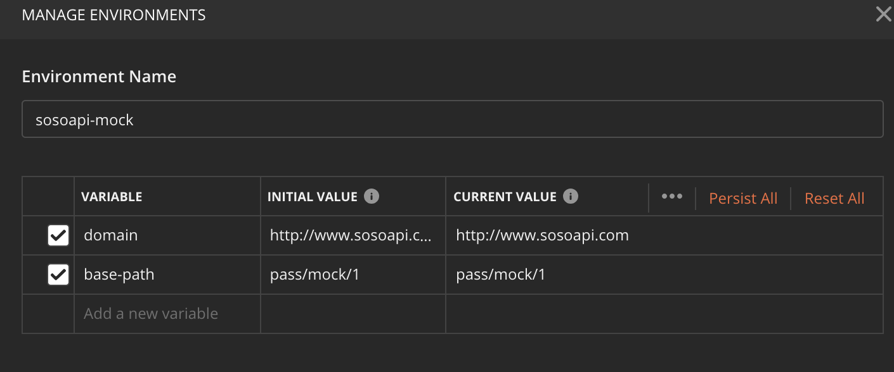
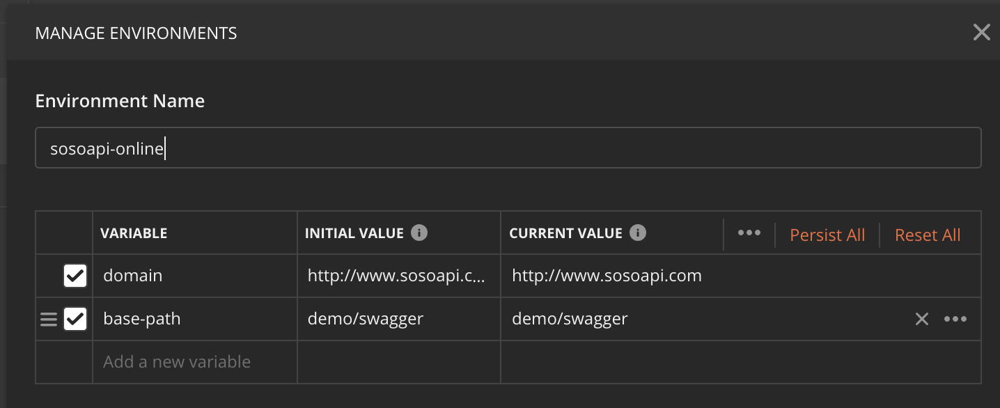
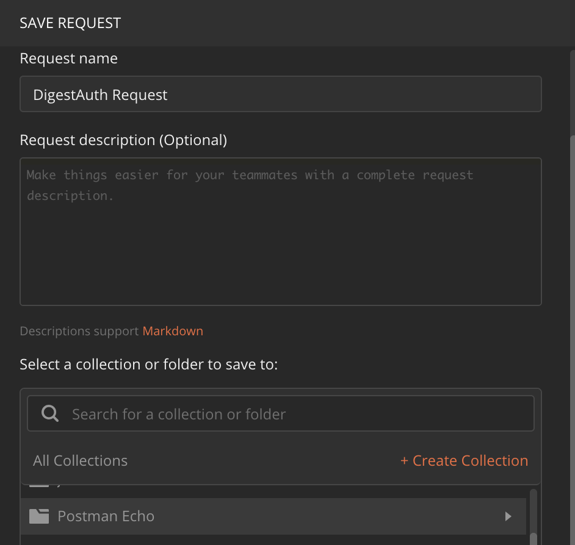
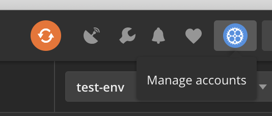

# postman的环境使用
postman里有环境的设置，就是我们常说的用变量代替一个固定的值，这样做的好处是可以切换不同的域名、不同的环境变量，不同的线上线下账户等等场景。下面就看下怎么用吧。
## 创建一个Environment
postman有一个envrionment（环境）设置的地方。请看下图：

要设置一个环境，可以点击那个齿轮。
添加一个测试环境的变量集合：

再添加一个线上环境的变量集合：

可以看到host变量代表了线上和线下两个域名。这样就可以覆盖不同域名的测试场景了。当在测试环境时用测试的域名进行测试，当上线后用线上的域名进行回归。
## 将固定值用变量代替
之前我们在写url的时候是这样写：
http://www.xxx.com/api/user/get
有了环境之后我们可以这样写：
{{domain}}/{{base-path}}/user/get
相信大家一看就能明白了。
而切换也非常容易。直接选择下拉框就可以了。
这样一个用例就可以测试多个环境了。
其实，除了用在域名，也可以用户请求参数、请求头中，大家可以在测试过程中体验一下。
## 小结
postman的参数化提供了一种简单的切换操作，降低了因为不同值而写多条用例的成本，值得一试。

# postman的用例集
之前几期文章介绍了怎么进行http请求的发送记忆参数化设置。下面简单跟大家说说postman的collection。
## collection的使用
新建一个collection比较简单，就是在Collections下面新建一个Collection就可以了。
当我们想要保存之前的一个测试用例时，只需要点击Save就可以了。
然后会弹出保存的对话框，像下面那样：

只需要在下面选择你创建的Collection文件夹即可。这样就保存成功了。
## Collection保持同步

Collection的好处有很多，规范化、保持同步、易于查找、可批量运行等。下面我来说说怎么保持同步。
首先是注册postman，这个我就不说了，应该安装后都会弹出。如果之前没有创建过账户，也可以通过最后的按钮Manage accounts进行注册。这样不同机器上，你只需要登录你的账户就可以将Collection同步过来了。
## 小结
这篇文章跟大家简单说了下Collection的功能。当然Collection功能非常强大。后面会陆续结合其他功能一起再聊。
